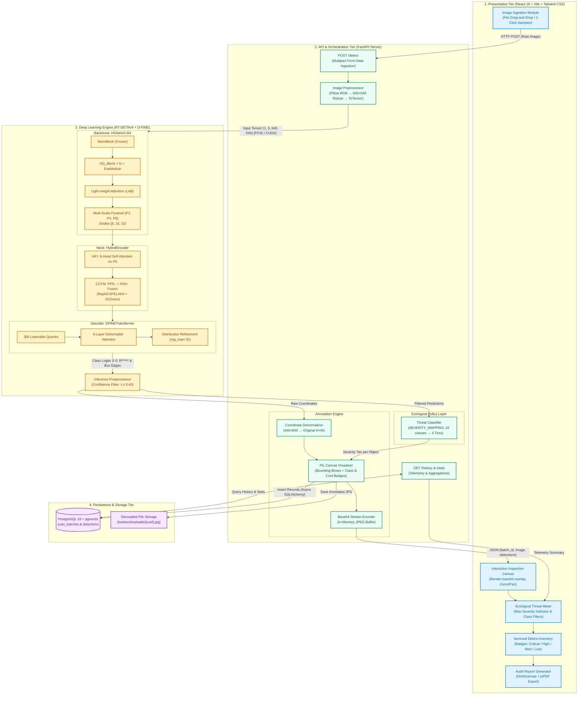
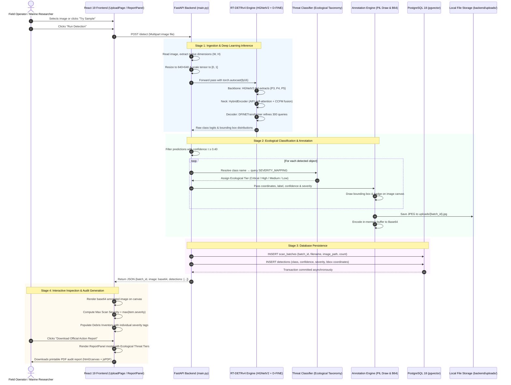

# Blue Sentinel: Comprehensive Technical & Architectural Reference

This document provides a consolidated, deep-dive reference covering the machine learning architecture, initialization strategy, preprocessing pipeline, loss functions, numerical precision, ecological threat taxonomy, system workflow, flowcharts, deployment topology, runtime failure mode / exception diagnostics, and **comparative literature analysis against the foundational base paper (*An improved YOLOv11 network for marine debris detection in underwater environment*)**, detailing the **MixStructureBlock** and **Efficient Multi-scale Attention (EMA)** modules implemented in or referenced by the **Blue Sentinel** marine debris detection platform.

---

## 1. System & Model Overview

* **Task:** Real-time underwater marine debris detection and ecological threat auditing.
* **Target Dataset:** **TrashCan-Instance** (COCO format, 22 classes spanning marine fauna, equipment, and anthropogenic debris).
* **Core Model Architecture:** **RT-DETRv4** (Hybrid CNN-Transformer Deep Neural Network):
  * **Backbone:** **HGNetV2-B4** (High-Performance GPU Convolutional Network).
  * **Neck:** **HybridEncoder** (Decoupled AIFI + CCFM).
  * **Decoder:** **DFINETransformer** (6 layers, 300 queries, Deformable Attention, Fine-Grained Localization distribution heads).
* **Foundational Literature Reference:** [*An improved YOLOv11 network for marine debris detection in underwater environment*](file:///c:/Users/user/Desktop/blueSent-FE/BlueSentinel.pdf) (Jing et al., *Scientific Reports*, 2026, 16:7074), comparing the deployed Transformer architecture with the base paper's YOLOv11 + MixStructureBlock + EMA detector (see Section 14).
* **Application Stack:**
  * **Frontend:** React 19, Tailwind CSS v4, Lucide icons, `html2canvas` + `jsPDF`.
  * **Backend:** FastAPI, PyTorch, Torchvision, Hugging Face Hub.
  * **Database:** PostgreSQL 18 with async SQLAlchemy, `asyncpg`, and `pgvector`.
  * **Local Generative AI:** Ollama running Llama-3.1 (8B) for automated environmental audit synthesis.

---

## 2. Model Initialization & Transfer Learning Strategy

The model initialization is divided between training fine-tuning and runtime service startup:

### A. Training / Fine-Tuning Initialization
* **Base Pretrained Weights:** Official **RT-DETRv4-L COCO-pretrained checkpoint**.
* **Head Re-Initialization:** The 80-class COCO classification heads were discarded and re-initialized from scratch for the 22 target TrashCan categories (0-indexed values `0` to `21`).
* **Backbone Freezing Strategy:**
  * `freeze_stem_only: True` and `freeze_at: 0`: Freezes the initial convolutional StemBlock of the HGNetV2 backbone, leaving stages 1 through 4 trainable.
  * `freeze_norm: True`: Replaces all `BatchNorm2d` layers in the backbone with `FrozenBatchNorm2d`. This freezes running statistics ($\mu, \sigma^2$) and affine parameters to avoid unstable gradient fluctuations under small batch sizes (batch size of 8 on a single Tesla T4 GPU).
* **Optimizer Configuration (AdamW):**
  * **Base Learning Rate:** $2.5 \times 10^{-4}$ (heads, HybridEncoder, DFINETransformer).
  * **Backbone Learning Rate:** $1.25 \times 10^{-5}$ ($20\times$ reduced rate to preserve foundational visual representations).
  * **Weight Decay:** $1.25 \times 10^{-4}$ (with `weight_decay: 0.0` for normalization layers in encoder/decoder).
* **Schedule & Session Resumption:** 58 total epochs on a single Tesla T4 GPU. Training was resumed using full optimizer, scheduler, and Exponential Moving Average (EMA) state preservation across Kaggle 12-hour session limits.

### B. Runtime / Inference Initialization (`backend/main.py`)
1. **Repository Setup:** Clones `RT-DETRv4` and applies an in-place patch to `engine/rtv4/hybrid_encoder.py` to fix a PyTorch device-mismatch issue on positional embeddings (`pos_embed.to(src_flatten.device)`).
2. **Weight Retrieval:** Downloads fine-tuned weights (`best.pth`) from the Hugging Face repository `coding-droid-123/trashcan-dfine`.
3. **Model Construction:** Instantiates the model using `YAMLConfig("dfine_hgnetv2_l_trashcan.yml")` with `HGNetv2.pretrained: False` (preventing redundant COCO downloads).
4. **State Dict Extraction:** Extracts Exponential Moving Average (EMA) weights (`checkpoint['ema']['module']` or fallback to `checkpoint['model']`).
5. **Deployment Optimization:** Calls `.deploy()` on both model and postprocessor, wraps them in `RTDETRWrapper`, sets to `.eval()`, and transfers to the active compute device (`cuda:0` if available, otherwise `cpu`).

---

## 3. Image Preprocessing, Enhancement, and Resizing

### A. Training Image Enhancements & Augmentations
Configured in `backend/RT-DETRv4/configs/base/dataloader.yml` and `dfine_hgnetv2_l_trashcan.yml`:
1. **Photometric Distortion (`RandomPhotometricDistort`, $p=0.5$):**
   * Uses `torchvision.transforms.v2.RandomPhotometricDistort`.
   * Randomly jitters brightness ($[0.875, 1.125]$) and contrast ($[0.5, 1.5]$).
   * Converts to HSV space to randomize saturation ($[0.5, 1.5]$) and hue ($[-0.05, 0.05]$) to simulate underwater color absorption, turbidity, and variable depth illumination.
2. **Multi-Scale and Composite Augmentations:**
   * **Mosaic:** Combines 4 randomly sampled images into a single composite mosaic canvas with affine transforms.
   * **Mixup (active epochs 5–29):** Linearly blends image pairs and target annotations ($\beta \in [0.45, 0.55]$):
     $$\text{Image}_{\text{mix}} = (1 - \beta) \cdot \text{Image}_1 + \beta \cdot \text{Image}_2$$
   * **RandomIoUCrop ($p=0.8$):** Crops patches ensuring minimum overlap criteria.
   * **Augmentation-Free Tail:** All augmentations are terminated at epoch 48 (`stop_epoch: 48`), leaving the final 10 epochs for representation stabilization.

### B. Inference Preprocessing (`backend/main.py`)
```python
IMAGE_TRANSFORMS = T.Compose([
    T.Resize((640, 640)), 
    T.ToTensor()
])
```
* **ImageNet Normalization Clarification:** The codebase **does not** perform ImageNet mean/standard deviation normalization (`transforms.Normalize`). Instead, `ToTensor()` and `ConvertPILImage(scale=True)` scale pixel values linearly from $[0, 255]$ into $[0.0, 1.0]$. The initial `ConvBNAct` layers in the HGNetV2 backbone dynamically handle feature centering and scaling.
* *(Note: Algorithm 1 in `IEEE_Research_Paper.md` refers to "ImageNet Normalization" as a high-level documentation label, but the executable code operates strictly on $[0.0, 1.0]$).*

### C. Why Images Are Resized to $640 \times 640$
1. **Model Pretraining Alignment:** The convolutional receptive fields and transformer positional embeddings were trained at $640 \times 640$.
2. **Exact Feature Strides:** Ensures spatial feature maps align cleanly with downsampling strides $\{8, 16, 32\}$:
   * $P_3$ (stride 8): $80 \times 80$ ($6{,}400$ tokens)
   * $P_4$ (stride 16): $40 \times 40$ ($1{,}600$ tokens)
   * $P_5$ (stride 32): $20 \times 20$ ($400$ tokens)
3. **Real-Time Latency & OOM Prevention:** Prevents quadratic memory explosion ($O(N^2)$) in transformer self-attention when processing high-resolution raw camera inputs (e.g., 4K or 12MP ROV feeds).
4. **Coordinate Restoration via `orig_size`:** The original dimensions `[w, h]` are passed to the postprocessor alongside the resized tensor, allowing predictions to be un-scaled back to native image coordinates without geometric distortion:
   $$\text{box}_{\text{native}} = \text{box}_{\text{norm}} \times [w, h, w, h]$$

---

## 4. Model Architecture & Major Components

### Architectural Pipeline
```
Raw Image (H×W)
       │
       ▼ [IMAGE_TRANSFORMS: Resize(640, 640), ToTensor()]
Tensor x ∈ R^{1 × 3 × 640 × 640}
       │
       ▼
┌─────────────────────────────────────────────────────────────────┐
│ BACKBONE: HGNetV2-B4                                            │
│ - StemBlock (Frozen entry convs)                                │
│ - Stages 1–4 (Trainable HG_Blocks + EseModule + LAB)            │
│ Output: Pyramids {P3, P4, P5} with strides {8, 16, 32}          │
└──────────────────────────────┬──────────────────────────────────┘
                               ▼
┌─────────────────────────────────────────────────────────────────┐
│ NECK: HybridEncoder                                             │
│ - Input Projections: 1×1 convs -> 256 channels                  │
│ - AIFI: 8-head self-attention on P5 (20×20 = 400 tokens)        │
│ - CCFM: Top-Down FPN + Bottom-Up PAN via RepNCSPELAN4 & SCDown  │
│ Output: Fused features {F3, F4, F5} ∈ R^{256 × H/s × W/s}      │
└──────────────────────────────┬──────────────────────────────────┘
                               ▼
┌─────────────────────────────────────────────────────────────────┐
│ DECODER: DFINETransformer                                       │
│ - 300 learnable object queries                                  │
│ - 6 decoder layers with Deformable Cross-Attention              │
│ - Classification Head: 22 class logits per query                │
│ - Localization Head (FGL/DDF): 32 distance bins per edge        │
└──────────────────────────────┬──────────────────────────────────┘
                               ▼
┌─────────────────────────────────────────────────────────────────┐
│ POSTPROCESSOR: PostProcessor                                    │
│ - Sigmoid activation on class logits                            │
│ - Integral expectation over edge distribution bins              │
│ - Coordinate un-scaling using orig_size                         │
│ Output: labels, boxes, scores                                   │
└─────────────────────────────────────────────────────────────────┘
```

### Detailed Component Roles:

#### 1. AIFI (Attention-based Intra-scale Feature Interaction)
* **Location:** `backend/RT-DETRv4/engine/rtv4/hybrid_encoder.py` (lines 419–437)
* **Mechanism:**
  1. Targets only $P_5$ (`use_encoder_idx: [2]`, shape `[B, 256, 20, 20]`).
  2. Collapses spatial dimensions and permutes to sequence format: `[B, 400, 256]`.
  3. Injects 2D sine-cosine spatial positional embeddings.
  4. Runs 8-head self-attention + LayerNorm + FFN to establish global semantic relationships across the entire image.
  5. Reshapes tokens back to `[B, 256, 20, 20]` for convolutional fusion.
* **Why only $P_5$:** $P_5$ has only 400 tokens. Running self-attention on $P_3$ ($6{,}400$ tokens) would require $\approx 256\times$ more memory and computation.

#### 2. CCFM (Cross-scale Feature-Fusion Module)
* **Location:** `backend/RT-DETRv4/engine/rtv4/hybrid_encoder.py` (lines 444–462)
* **Mechanism:**
  * **Top-Down FPN:** Interpolates higher-level features by $2\times$ (nearest-neighbor), concatenates with lateral lower-level features, and fuses them via `RepNCSPELAN4` blocks.
  * **Bottom-Up PAN:** Downsamples features using spatial-channel downsampling (`SCDown`), concatenates with higher-level features, and refines them via `RepNCSPELAN4` blocks.
  * Ensures high-level semantic context is propagated down to guide fine spatial localization at $P_3$ and $P_4$.

#### 3. DFINETransformer Decoder
* **Location:** `backend/RT-DETRv4/engine/rtv4/dfine_decoder.py`
* **Mechanism:**
  * Uses 300 learnable queries.
  * Employs multi-scale deformable cross-attention with sampling points `num_points: [3, 6, 3]` across feature levels.
  * **Fine-Grained Localization (FGL):** Models each bounding box edge $e_j \in \{l, t, r, b\}$ as a probability distribution over $N_{\text{reg}} = 32$ discrete distance bins rather than predicting a single deterministic number:
    $$e_j = \sum_{k=0}^{N_{\text{reg}}} k \cdot \text{softmax}\left(\frac{w_{j,k}}{\tau}\right) \cdot s$$

---

## 5. Loss Functions & Target Matching

Implemented in `RTv4Criterion` (`backend/RT-DETRv4/engine/rtv4/rtv4_criterion.py`):

$$\mathcal{L}_{\text{total}} = 1.0 \cdot \mathcal{L}_{\text{VFL}} + 5.0 \cdot \mathcal{L}_{\text{L1}} + 2.0 \cdot \mathcal{L}_{\text{GIoU}} + 0.15 \cdot \mathcal{L}_{\text{FGL}} + 1.5 \cdot \mathcal{L}_{\text{DDF}}$$

| Loss Component | Identifier | Weight | Description |
| :--- | :--- | :--- | :--- |
| **Varifocal Loss** | $\mathcal{L}_{\text{VFL}}$ | $1.0$ | Asymmetric classification loss weighting positive samples by continuous IoU scores. |
| **L1 Bounding Box Loss** | $\mathcal{L}_{\text{L1}}$ | $5.0$ | Minimizes absolute distance between predicted and ground-truth normalized $(c_x, c_y, w, h)$. |
| **Generalized IoU Loss** | $\mathcal{L}_{\text{GIoU}}$ | $2.0$ | Scale-invariant bounding box alignment penalizing non-overlapping empty space. |
| **Fine-Grained Localization Loss** | $\mathcal{L}_{\text{FGL}}$ | $0.15$ | Unimodal focal loss supervising probability distributions over the 32 discrete edge distance bins. |
| **Dense Distribution Fusion Loss** | $\mathcal{L}_{\text{DDF}}$ | $1.5$ | Distills edge distribution representations across intermediate decoder layers for deep supervision. |

* **Hungarian Matcher:** Bipartite matching pairs the 300 queries to ground-truth objects 1-to-1 using cost weights: $\text{class} = 2$, $\text{bbox} = 5$, $\text{GIoU} = 2$.

---

## 6. Numerical Precision Strategy: FP16 & FP32 Master Weights

### A. Runtime Inference (FP16)
In `backend/main.py`:
```python
with torch.no_grad():
    if "cuda" in str(DEVICE):
        with torch.autocast(device_type="cuda", dtype=torch.float16):
            output = MODEL(im_data, orig_size)
    else:
        output = MODEL(im_data, orig_size)
```
* Uses CUDA Tensor Cores for matrix multiplications and convolutions.
* Cuts VRAM usage by ~50% and doubles inference throughput.
* **Important Distinction:** FP16 is **half-precision floating point / mixed-precision acceleration**, **not quantization** (quantization specifically refers to integer casting such as INT8 or INT4).

### B. Training Precision (AMP with FP32 Master Copy)
Configured with `use_amp: True` in `optimizer.yml`. While forward and backward operations execute in FP16, **a master copy of weights is strictly maintained in FP32**:
1. **Preventing Underflow to Zero:** In FP16 (10-bit mantissa), small gradient updates $\Delta W = -\eta \cdot g$ (e.g., $1.25 \times 10^{-5} \times 10^{-3} = 10^{-8}$) cannot be represented when added to a weight $W = 0.5$. The update rounds to zero, causing training to stall. FP32 (23-bit mantissa) accumulates these tiny updates without precision loss.
2. **AdamW Variance Denominator ($g^2$):** Squaring small gradients ($10^{-3} \to 10^{-6}$) underflows near the FP16 minimum limit ($\approx 6.1 \times 10^{-5}$), corrupting optimizer variance tracking. FP32 ensures accurate momentum and variance buffers.
3. **Preventing Overflow:** FP16 overflows at $65{,}504$. Reductions across large tensors would trigger `inf`/`NaN` errors.

---

## 7. Model Taxonomy: ML Model vs. DNN vs. Transformer

RT-DETRv4 represents an intersection of all three paradigms:

```
Artificial Intelligence (AI)
  └── Machine Learning (ML)
        └── Deep Neural Network (DNN)
              └── Hybrid CNN-Transformer Architecture (RT-DETRv4)
```

1. **It is an ML Model:** Learns continuous representations and decision boundaries from annotated empirical data (TrashCan dataset) rather than using explicit heuristics.
2. **It is a Deep Neural Network (DNN):** Composed of dozens of stacked convolutional, normalization, and linear projection layers with millions of trainable parameters optimized via backpropagation.
3. **It is a Transformer:** Specifically an **anchor-free Detection Transformer (DETR)**. Eliminates hand-crafted non-maximum suppression (NMS) and anchor priors by formulating object detection as direct set prediction through:
   * **Intra-scale Self-Attention (AIFI)** in the encoder neck.
   * **Multi-scale Deformable Cross-Attention** in the 6-layer decoder.
   * **300 learnable object queries** that independently query image feature tokens.

---

## 8. Ecological Severity Taxonomy & Policy Layer

The deep learning detector only outputs object category names; it has no innate understanding of environmental hazards. The **Threat Classifier** in `backend/main.py` functions as a domain-specific ecological policy layer, mapping all 22 classes into 4 standardized risk tiers:

```python
SEVERITY_MAPPING = {
    # Critical: Immediate wildlife entanglement hazard & lethal ghost gear
    "trash_net": "critical",
    "trash_rope": "critical",
    "trash_tarp": "critical",

    # High: Non-biodegradable synthetic polymers & chemical leaching (450+ year half-life)
    "trash_bottle": "high",
    "trash_bag": "high",
    "trash_container": "high",
    "trash_snack_wrapper": "high",
    "trash_cup": "high",
    "trash_pipe": "high",
    "trash_wreckage": "high",

    # Medium: Structural artificial waste, fabrics, and general artificial debris
    "trash_can": "medium",
    "trash_clothing": "medium",
    "trash_unknown_instance": "medium",

    # Low: Biodegradable organic matter, survey hardware, and living marine fauna
    "trash_branch": "low",
    "rov": "low",
    "plant": "low",
    "animal_fish": "low",
    "animal_starfish": "low",
    "animal_shells": "low",
    "animal_crab": "low",
    "animal_eel": "low",
    "animal_etc": "low",
}
```

### Dynamic Scan-Level Severity
The overall severity for a given survey scan is computed dynamically from the highest ecological risk tier present among detected objects:
$$\text{Scan Severity} = \max_{d \in \text{detections}} \left(\text{rank}(d.\text{severity})\right)$$
where $\text{rank}(\text{critical}) = 4, \text{rank}(\text{high}) = 3, \text{rank}(\text{medium}) = 2, \text{rank}(\text{low}) = 1$.
* A scan with 1 ghost net (`trash_net`) correctly triggers **`CRITICAL`** urgency.
* A scan with multiple living organisms (`animal_fish`, `animal_starfish`) correctly remains **`LOW`**.

---

## 9. Annotation Engine vs. Dataset Annotations

| Characteristic | Dataset Annotations (JSON) | Annotation Engine (Runtime) |
| :--- | :--- | :--- |
| **Phase** | **Before & During Training** | **After Training (Inference Runtime)** |
| **Source** | Human marine scientists / annotators | Automated algorithmic execution in `main.py` |
| **Format** | COCO JSON file (`instances_train.json`) | In-memory PIL rendering & Base64 stream |
| **Content** | Ground-truth coordinates $[x, y, w, h]$, image metadata, category IDs | Predicted bounding boxes, confidence badges, severity tags |
| **Purpose** | Target label used by Hungarian Matcher to calculate loss gradients | Burn visual feedback onto image for operator inspection & PDF audits |

In the Blue Sentinel runtime pipeline, the **Annotation Engine**:
1. Denormalizes output coordinates from $640 \times 640$ back to original camera resolution $(W_{\text{orig}}, H_{\text{orig}})$.
2. Draws colored bounding boxes and text badges displaying predicted class and model confidence.
3. Saves the annotated JPEG to decoupled persistent disk storage (`backend/uploads/{batch_id}.jpg`).
4. Encodes an in-memory buffer into a Base64 string for immediate single-roundtrip display on the React inspection canvas.

---

## 10. End-to-End System Flowcharts

### A. High-Level Architecture Flowchart



---

### B. Runtime Execution Sequence Diagram



---

## 11. Distributed Dual-Node & Hybrid Edge Deployment Architecture

To support field operations on research vessels and coastal stations without recurring cloud GPU hosting fees ($100–$300/month), Blue Sentinel supports a **Hybrid Edge-Cloud Architecture**:

```
                       PUBLIC INTERNET
                              │
               ┌──────────────┴──────────────┐
               ▼                             ▼
      [Vercel Global Edge]          [Cloudflare Edge]
       React 19 Dashboard         Zero-Trust Ingress Tunnel
               │                             │
═══════════════╪═════════════════════════════╪═══════════════════════
               │               SECURE LOCAL EDGE NETWORK
               │                             │ (Encrypted HTTPS Tunnel)
               ▼                             ▼
   [Client Browser / Tablet] ────► [Node A: Web & Vision Server]
                                    - FastAPI Gateway (Port 8000)
                                    - PostgreSQL 18 + pgvector
                                    - RT-DETRv4 in FP16 (RTX 4050 6GB)
                                             │
                                             │ (Tailscale WireGuard Mesh)
                                             ▼
                                   [Node B: AI Reporting Service]
                                    - Ollama Service (Port 11434)
                                    - Llama-3.1 8B Q4_K_M (RTX 3050 24GB)
                                    - Ecological Narrative Synthesis
```

### Node Specifications & Workload Separation:
1. **Frontend (Vercel CDN):** Serverless static Single-Page Application (SPA) providing global low-latency access. Connects to backend via `VITE_API_URL` pointed at the Cloudflare Tunnel domain.
2. **Node A: Web & Vision Server:**
   * **Hardware:** NVIDIA GeForce RTX 4050 GPU (6 GB VRAM), 16 GB RAM.
   * **Workload:** FastAPI endpoints, database transactions, image preprocessing, and RT-DETRv4 inference in FP16. Consumes ~1.8–2.2 GB VRAM at batch size 1, leaving abundant memory headroom.
3. **Node B: AI Reporting Microservice:**
   * **Hardware:** NVIDIA GeForce RTX 3050 GPU, 24 GB RAM.
   * **Workload:** Ollama hosting Llama-3.1 (8B) quantized to Q4_K_M (~4.8 GB memory). Synthesizes natural-language ecological risk audits from detection summaries.
4. **Networking Security:**
   * **Cloudflare Tunnel (`cloudflared`):** Outbound tunnel from Node A provides public HTTPS ingress without port forwarding or exposing local IP addresses.
   * **Tailscale Mesh:** Point-to-point WireGuard encrypted tunnel between Node A and Node B isolates the Ollama API entirely from public network exposure.

---

## 12. Verification & Validation Metrics

* **Evaluation Metric Standards:** In object detection, generic "accuracy" is an invalid metric. Performance is strictly quantified via COCO mean Average Precision (mAP) and per-class Average Precision (AP):
  * **Overall $\text{AP}@0.50$:** **0.686 (68.6%)** across all 22 classes.
  * **Overall $\text{AP}@[0.50:0.95]$:** **0.517 (51.7%)** across IoU range 0.50–0.95.
  * **High-Risk Rigid Anthropogenic Debris:** Achieves **0.82 to 1.00 (82%–100%) $\text{AP}@0.50$** on high-contrast man-made objects (`trash_pipe`, `trash_bottle`, `trash_wreckage`, `trash_can`).
  * **Camouflaged & Deformable Categories:** Ranging **0.17 to 0.64 $\text{AP}@0.50$** on natural marine organisms and thin deformable plastics (`animal_crab`, `animal_shells`, `trash_tarp`) due to natural seafloor mimicry and underwater light scattering.

---

## 13. Training & Runtime Failure Modes: Comprehensive RuntimeError Diagnostic Guide

This section catalogs the critical execution failure modes, `RuntimeError` triggers, tensor lifecycle edge cases, and hardware memory faults encountered across the RT-DETRv4 training loop ([det_solver.py](file:///c:/Users/user/Desktop/blueSent-FE/backend/RT-DETRv4/engine/solver/det_solver.py)), distillation pipeline, and FastAPI inference service.

```
                                  RUNTIME FAILURE TAXONOMY
                                             │
      ┌────────────────────┬─────────────────┼────────────────────┬────────────────────┐
      ▼                    ▼                 ▼                    ▼                    ▼
[Checkpoint & EMA]   [CUDA / VRAM]     [Cross-Device]       [Autograd Graph]     [Target / DDP]
• Missing Stage 1    • OOM during      • pos_embed on CPU   • In-place tensor    • Degenerate boxes
• StateDict mismatch   Attention/Loss  • Teacher/Student      modifications      • Target shape mismatch
• Metric loop creep  • Batch & stride    device divergence  • Retained graph     • NCCL rank barrier
• NoneType output_dir  leaks           • DataLoader memory    double backward      synchronization
```

---

### A. Checkpoint & Staged Training Lifecycle Exceptions (`det_solver.py`)

The RT-DETRv4 training pipeline executes a two-stage training scheme demarcated by `stop_epoch` (typically epoch 48 out of 58 in `dfine_hgnetv2_l_trashcan.yml`). Several brittle checkpoint and EMA state transitions occur in this logic:

#### 1. Missing Stage 1 Checkpoint on Stage 2 Transition (`FileNotFoundError` / `RuntimeError`)
* **Code Location:** [det_solver.py:L72-L76](file:///c:/Users/user/Desktop/blueSent-FE/backend/RT-DETRv4/engine/solver/det_solver.py#L72-L76) and [det_solver.py:L195-L199](file:///c:/Users/user/Desktop/blueSent-FE/backend/RT-DETRv4/engine/solver/det_solver.py#L195-L199)
  ```python
  # Epoch boundary check
  if epoch == self.train_dataloader.collate_fn.stop_epoch:
      self.load_resume_state(str(self.output_dir / 'best_stg1.pth'))
      self.ema.decay = self.train_dataloader.collate_fn.ema_restart_decay

  # Post-validation fallback when epoch is not the best epoch
  elif epoch >= self.train_dataloader.collate_fn.stop_epoch:
      best_stat = {'epoch': -1, }
      self.ema.decay -= 0.0001
      self.load_resume_state(str(self.output_dir / 'best_stg1.pth'))
  ```
* **Failure Mechanism:** If training begins with `stop_epoch == 0`, if evaluation was skipped during Stage 1, or if validation metrics failed to improve prior to `stop_epoch`, `best_stg1.pth` is never written to disk at line 193 (`dist_utils.save_on_master(...)`). Calling `self.load_resume_state(...)` subsequently invokes `torch.load()`, throwing:
  ```text
  FileNotFoundError: [Errno 2] No such file or directory: 'output/dfine_hgnetv2_l_trashcan/best_stg1.pth'
  # Or if written partially during an aborted process:
  RuntimeError: PytorchStreamReader failed reading zip archive: failed finding central directory
  ```
* **Mitigation:** Ensure `stop_epoch > 0`, verify that validation evaluation runs at least once before the stop boundary, and wrap `load_resume_state` with a filesystem guard checking `(self.output_dir / 'best_stg1.pth').is_file()`.

#### 2. Architecture State Dict Mismatch (`RuntimeError: Error(s) in loading state_dict`)
* **Code Location:** [BaseSolver.load_resume_state](file:///c:/Users/user/Desktop/blueSent-FE/backend/RT-DETRv4/engine/solver/_solver.py#L165-L174)
* **Failure Mechanism:** Occurs when attempting to resume fine-tuning from an 80-class COCO checkpoint directly via `load_resume_state` instead of `load_tuning_state`:
  ```text
  RuntimeError: Error(s) in loading state_dict for RTDETR:
      size mismatch for decoder.denoising_class_embed.weight: copying a param with shape torch.Size([80, 256]) from checkpoint, the shape in current model is torch.Size([22, 256]).
      size mismatch for decoder.enc_score_head.weight: copying a param with shape torch.Size([80, 256]) from checkpoint, the shape in current model is torch.Size([22, 256]).
  ```
* **Mitigation:** Use `load_tuning_state()` for transfer learning across datasets with divergent class counts. `load_tuning_state` runs `_adjust_head_parameters` and loads with `strict=False`, whereas `load_resume_state` demands an exact bitwise key and tensor shape match.

#### 3. Metric Iteration EMA Decay Drift Bug
* **Code Location:** [det_solver.py:L162-L201](file:///c:/Users/user/Desktop/blueSent-FE/backend/RT-DETRv4/engine/solver/det_solver.py#L162-L201)
* **Failure Mechanism:** The checkpoint persistence logic is nested inside the loop `for k in test_stats:`. If the evaluator returns multiple dictionary keys (e.g., `coco_eval_bbox`, `loss`), the `elif epoch >= stop_epoch` branch executes **for every single metric key**. Consequently:
  * `self.ema.decay -= 0.0001` decrements multiple times per epoch instead of once.
  * `self.load_resume_state()` re-reads weights from disk multiple times in the same epoch, risking race conditions and CPU/GPU memory fragmentation.
* **Mitigation:** Un-nest the checkpoint comparison and EMA adjustment logic outside of the `for k in test_stats:` loop, evaluating strictly against the primary optimization metric (e.g., `test_stats['coco_eval_bbox'][0]`).

#### 4. Uninitialized Output Directory (`TypeError: unsupported operand type(s)`)
* **Code Location:** [det_solver.py:L193](file:///c:/Users/user/Desktop/blueSent-FE/backend/RT-DETRv4/engine/solver/det_solver.py#L193)
* **Failure Mechanism:** If `--output-dir` is not supplied via CLI or is set to `None` in the configuration YAML, path concatenation `self.output_dir / 'best_stg1.pth'` raises `TypeError: unsupported operand type(s) for /: 'NoneType' and 'str'`.

---

### B. GPU Memory Allocation Failures (`torch.cuda.OutOfMemoryError`)

* **Hierarchy:** `torch.cuda.OutOfMemoryError` inherits directly from `RuntimeError`.
* **Triggers & Locations:**
  1. **Forward Pass in `train_one_epoch` ([det_engine.py](file:///c:/Users/user/Desktop/blueSent-FE/backend/RT-DETRv4/engine/solver/det_engine.py)):**
     * Multi-scale feature token maps $\{P_3, P_4, P_5\}$ concatenated across 300 queries create large attention correlation tensors.
     * High batch sizes ($>8$ on a 16 GB Tesla T4 or $>1$ on a 6 GB RTX 4050) exceed SRAM/VRAM limits during backward autograd gradient retention.
  2. **Evaluation Memory Spikes in `evaluate()`:**
     * Validation datasets containing high-resolution raw images without fixed $640 \times 640$ resizing cause deformable cross-attention token buffers to scale quadratically.
  3. **Teacher-Student Distillation:**
     * When `self.teacher_model` is enabled in `train_one_epoch(..., teacher_model=self.teacher_model)`, both the student network and the teacher backbone occupy GPU memory simultaneously.
* **Diagnostic & Prevention Protocol:**
  * Enforce FP16 mixed precision (`torch.autocast(device_type="cuda", dtype=torch.float16)`).
  * Reduce training batch size to $\le 8$ (T4) or $\le 2$ (RTX 4050) and compensate with gradient accumulation.
  * Ensure the teacher model is set to `.eval()` and all its parameters have `requires_grad = False` to prevent backward graph retention.
  * Clear tensor caches at epoch boundaries via `torch.cuda.empty_cache()`.

---

### C. Cross-Device Tensor Synchronization Errors (`RuntimeError: Expected all tensors to be on the same device`)

* **Error Signature:** `RuntimeError: Expected all tensors to be on the same device, but found at least two devices, cuda:0 and cpu!`
* **Known System Vulnerabilities:**
  1. **HybridEncoder Positional Embeddings:**
     * In unpatched RT-DETRv4 (`hybrid_encoder.py`), `pos_embed` was initialized on the default host device (CPU) while image features `src_flatten` resided on `cuda:0`.
     * **Repository Patch Applied:** Explicit device transfer `pos_embed = pos_embed.to(src_flatten.device)` applied dynamically in `backend/main.py` before model loading.
  2. **Teacher Model Initialization Divergence:**
     * In [det_solver.py:L92](file:///c:/Users/user/Desktop/blueSent-FE/backend/RT-DETRv4/engine/solver/det_solver.py#L92), if `self.teacher_model` is constructed on CPU while `self.model` is moved to `self.device` (`cuda:0`), passing both to `train_one_epoch` fails when calculating distillation feature loss:
       ```python
       # Correct initialization pattern:
       if self.teacher_model is not None:
           self.teacher_model = self.teacher_model.to(self.device).eval()
       ```
  3. **DataLoader Pinned Memory Collator:**
     * If `collate_fn` returns tensors on CPU without non-blocking CUDA transfers before being passed into `model(samples)`, matrix multiplication kernels fail immediately.

---

### D. Autograd Graph Computation & In-Place Mutation Errors

#### 1. In-Place Tensor Modification (`RuntimeError: one of the variables needed for gradient computation has been modified by an inplace operation`)
* **Trigger:** Modifying bounding box coordinates, feature slices, or loss weights using in-place operators (`+=`, `*=` or slice assignment `tensor[:, :2] = ...`) on tensors that are tracked in the autograd computational graph.
* **Detection Loss Context:** Inside `RTv4Criterion` and Fine-Grained Localization distribution generation, coordinate transformations must be performed out-of-place:
  ```python
  # WRONG (Raises RuntimeError during loss.backward()):
  boxes[:, 0] += offset_x

  # CORRECT (Allocates fresh tensor in the computational graph):
  boxes = torch.cat([boxes[:, :1] + offset_x, boxes[:, 1:]], dim=-1)
  ```

#### 2. Re-Backwarding Through Intermediate Graphs (`RuntimeError: Trying to backward through the graph a second time`)
* **Trigger:** Retaining intermediate activation maps from previous epochs or from teacher forward passes without explicit `.detach()`.
* **Prevention:** Always detach teacher model logits and intermediate feature pyramids before computing distillation loss against student outputs:
  ```python
  with torch.no_grad():
      teacher_feats = teacher_model(samples).detach()
  ```

---

### E. Target Annotation & Hungarian Matcher Geometric Degradations

* **Error Signatures:**
  * `RuntimeError: The size of tensor a (N) must match the size of tensor b (M) at non-singleton dimension`
  * `RuntimeError: value cannot be converted to type int without overflow: nan`
* **Root Causes:**
  1. **Degenerate Bounding Boxes:** Annotations where $w \le 0$ or $h \le 0$ (or where $x_2 \le x_1$, $y_2 \le y_1$) cause Generalized IoU ($\mathcal{L}_{\text{GIoU}}$) denominators to reach 0, leading to `NaN` loss and autograd failure.
  2. **Unnormalized Coordinates:** Target bounding boxes expected in normalized $[0, 1]$ relative coordinates $[c_x, c_y, w, h]$ supplied in absolute pixel coordinates ($[0, 1920]$) cause Hungarian matcher costs to explode, triggering integer overflow.
  3. **Empty Target Batches:** Training batches where all images contain zero labeled objects (empty backgrounds) can cause loss division by total object count $N_{\text{targets}} = 0$. The criterion must clamp divisors: `num_boxes = max(num_boxes, 1)`.

---

### F. Distributed Data Parallel (DDP) & NCCL Synchronization Errors

* **Error Signature:** `RuntimeError: NCCL error: unhandled system error / NCCL operation timed out`
* **Trigger Mechanism:**
  * In distributed multi-GPU training (`dist_utils.is_dist_available_and_initialized()`), processes synchronize at barrier checkpoints (`dist.barrier()`) and during collective evaluation gathers.
  * In [det_solver.py:L179-L193](file:///c:/Users/user/Desktop/blueSent-FE/backend/RT-DETRv4/engine/solver/det_solver.py#L179-L193), `dist_utils.save_on_master(...)` writes state dicts exclusively on rank 0. If rank 0 experiences slow disk I/O while saving large `.pth` checkpoint files ($>500\text{ MB}$), worker ranks wait at subsequent collective operations and exceed the default NCCL timeout (30 minutes).
* **Prevention:**
  * Save checkpoints asynchronously or increase NCCL timeout in initialization:
    ```python
    torch.distributed.init_process_group(
        backend="nccl",
        timeout=datetime.timedelta(minutes=60)
    )
    ```

---

### G. Runtime Diagnostic Decision Matrix

| Symptom / Stack Trace | Primary Subsystem | Root Cause | Immediate Resolution |
| :--- | :--- | :--- | :--- |
| `FileNotFoundError: best_stg1.pth` | Checkpoint Engine | `stop_epoch` reached before `best_stg1.pth` saved | Verify `stop_epoch > 0` and ensure validation runs in Stage 1. |
| `size mismatch for ...class_embed` | Model Loader | Checkpoint class count does not match YAML | Use `load_tuning_state()` instead of `load_resume_state()`. |
| `CUDA out of memory` | VRAM Allocation | Batch size or input resolution exceeds GPU limits | Reduce batch size, enable FP16 mixed precision, call `empty_cache()`. |
| `Expected all tensors to be on same device` | Feature Encoder | `pos_embed` or `teacher_model` on CPU | Apply positional embedding patch and move all submodules to `self.device`. |
| `modified by an inplace operation` | Loss Criterion | In-place math (`+=`, slice mutation) on graph | Replace in-place operations with out-of-place tensor creation. |
| `Trying to backward ... a second time` | Distillation Engine | Retaining teacher/student graphs across passes | Call `.detach()` on teacher activations and wrap teacher in `no_grad()`. |
| `NCCL operation timed out` | DDP Orchestration | Disk I/O bottleneck during master rank saves | Increase `dist.init_process_group` timeout or save checkpoints asynchronously. |

---

## 14. Comparative Analysis: Blue Sentinel (RT-DETRv4 / D-FINE) vs. Base Paper Model (YOLOv11 + MixStructureBlock + EMA)

This section provides a comprehensive architectural and empirical comparison between the deployed **Blue Sentinel** system and the foundational literature provided in the codebase root ([BlueSentinel.pdf](file:///c:/Users/user/Desktop/blueSent-FE/BlueSentinel.pdf)): *"An improved YOLOv11 network for marine debris detection in underwater environment"* (Jing Yuanwei, Ding Yijiang, Wang Xuemei & Anis Salwa Mohd Khairuddin, *Scientific Reports*, 2026, 16:7074).

### A. Literature Overview & Problem Formulation
Underwater visual object detection operates under severe optical degradation:
1. **Wavelength-Dependent Light Attenuation & Color Cast:** Red spectral wavelengths are absorbed within the first 3–5 meters of water depth, leaving deep-sea imagery heavily skewed toward blue/green wavelengths with depressed dynamic range.
2. **Backscatter Turbidity & Particulate Haze:** Suspended organic matter (marine snow) and floating silt create non-uniform lighting and blurred, low-contrast object silhouettes.
3. **Deformability & Background Mimicry:** Synthetic debris (such as submerged tarps, fragmented bags, and frayed ropes) lacks rigid geometric shapes, while marine fauna (crabs, shells, flatfish) blends into rocky or sandy benthic substrates.

To resolve these challenges on the benchmark **TrashCan-Instance** dataset (22 classes), the two models adopt distinct paradigms:
* **The Base Paper Model** innovates within the **dense convolutional (CNN) paradigm**, engineering customized multi-scale convolution blocks (**MixStructureBlock**) and grouped attention (**EMA**) into a compact, lightweight YOLOv11 framework.
* **The Blue Sentinel Deployed Model** adopts the **Vision Transformer (DETR) paradigm**, using an end-to-end set-prediction architecture (**RT-DETRv4 / HGNetV2-L**) with fine-grained bounding-box probability distribution refinement (**D-FINE**), eliminating anchor boxes and Non-Maximum Suppression (NMS).

```
┌─────────────────────────────────────────────────────────────────────────────┐
│                    UNDERWATER MARINE DEBRIS DETECTION                       │
├──────────────────────────────────────┬──────────────────────────────────────┤
│  BASE PAPER MODEL (BlueSentinel.pdf) │  BLUE SENTINEL DEPLOYED (Codebase)   │
│  - Architecture: Enhanced YOLOv11    │  - Architecture: RT-DETRv4 + D-FINE  │
│  - Paradigm: Dense Single-Stage CNN  │  - Paradigm: End-to-End Transformer  │
│  - Backbone: MixStructureBlock       │  - Backbone: HGNetV2-B4              │
│  - Neck: EMA + PANet                 │  - Neck: HybridEncoder (AIFI + CCFM) │
│  - Head: Anchor-Free CNN + NMS       │  - Head: DFINETransformer + FGL      │
│  - Resolution: 416 × 416             │  - Resolution: 640 × 640             │
│  - Size: 5.20 MB (Ultralight)        │  - Size: ~35–45 MB (High Capacity)   │
└──────────────────────────────────────┴──────────────────────────────────────┘
```

---

### B. Base Paper Architecture: Key Components

#### 1. MixStructureBlock (Replaces `C3k2` in YOLOv11 Backbone & Neck)
* **Design Motivation:** The standard `C3k2` residual block in YOLOv11 relies on small, fixed-size convolutions with limited receptive fields. In marine environments where debris appears at diverse scales and often blends into background sediment, fixed kernels fail to capture long-range contextual cues.
* **Multi-Branch Dilated Convolutions:**
  * Applies parallel convolutional paths with kernel sizes $3\times3$, $5\times5$, and $7\times7$.
  * Integrates dilated convolutions ($d=3$) to enlarge receptive fields without inflating parameter count or computational cost.
* **Compound Multi-Attention Mechanisms:**
  * **Channel Attention (CA):** Employs global average pooling followed by a two-layer sigmoid MLP to reweight channels based on category relevance.
  * **Pixel Attention (PA):** Uses $1\times1$ convolutions and spatial gating to emphasize salient object pixels over turbid background noise.
  * **Simple Pixel Attention (SPA):** Combines grouped convolutions with spatial gating for lightweight spatial focus.
* **Feature Compression:** Multi-branch outputs are concatenated and compressed back to the original channel dimension via a $1\times1$ MLP layer with residual gradient shortcuts.

#### 2. Efficient Multi-Scale Attention (EMA) (Replaces `C2PSA` in YOLOv11 Neck)
* **Origin & Reference:** Proposed by Ouyang et al. (*ICASSP 2023*, *"Efficient Multi-Scale Attention Module with Cross-Spatial Learning"*).
* **Motivation:** YOLOv11's default `C2PSA` module models only pixel-wise spatial attention, ignoring higher-order cross-channel interactions. In turbid underwater conditions, purely spatial attention cannot separate subtle debris boundaries from background clutter.
* **Three-Stage Structural Mechanism:**
  1. **Group-Wise Channel Partitioning:**
     * Splits input feature tensor $X \in \mathbb{R}^{C \times H \times W}$ into $G$ sub-groups ($C // G$ channels each), distributing spatial-semantic learning across sub-feature spaces while conserving compute.
  2. **Parallel Multi-Scale Spatial Context Modeling:**
     * Within each group, features pass through two parallel sub-networks:
       * **1D Directional Global Pooling:** Applies 1D adaptive average pooling along the height ($H$) and width ($W$) axes separately (similar to Coordinate Attention), preserving horizontal and vertical coordinate localization.
       * **Local Spatial Encoding:** Passes features through a $3\times3$ convolution to extract local contextual dependencies.
  3. **Cross-Dimensional Attention Fusion & Calibration:**
     * Computes cross-dimensional interaction via matrix multiplication between the 1D global pooled spatial vectors and the $3\times3$ local feature descriptors.
     * Applies **Group Normalization (GroupNorm)** and a **Sigmoid** gating function to generate a 2D dynamic attention map.
     * The input feature map is modulated via element-wise multiplication, selectively amplifying salient debris targets while suppressing backscatter noise.

*(Clarification: In general machine learning, "EMA" frequently refers to Exponential Moving Average of weights during training. In the base paper context, it specifically refers to the Efficient Multi-Scale Attention module).*

---

### C. Side-by-Side Architectural & Empirical Comparison

| Technical Dimension | Base Paper Model (`BlueSentinel.pdf`) | Blue Sentinel Deployed Model (`backend/main.py`) |
| :--- | :--- | :--- |
| **Model Family** | Enhanced YOLOv11 (Single-Stage Dense CNN) | RT-DETRv4 + D-FINE (Real-Time Vision Transformer) |
| **Backbone Network** | Modified YOLOv11 Backbone (`MixStructureBlock`) | `HGNetV2-B4` (High-Performance GPU Net V2) |
| **Neck / Feature Fusion** | Modified PANet with `EMA` and `MixStructureBlock` | `HybridEncoder` (`AIFI` Self-Attention on $P_5$ + `CCFM` CNN Fusion) |
| **Decoder / Head** | Decoupled Anchor-Free Convolutional Heads | 6-Layer `DFINETransformer` (300 Object Queries + Deformable Cross-Attention) |
| **Bounding Box Regression** | Direct deterministic coordinate regression $(c_x, c_y, w, h)$ | Fine-Grained Localization (`FGL`): 32 probability distribution bins per edge |
| **Post-Processing** | IoU Non-Maximum Suppression (NMS) | **NMS-Free** (Direct set prediction via Hungarian matching) |
| **Input Resolution** | $416 \times 416$ | $640 \times 640$ |
| **Model Disk Size** | **5.20 MB** (~2.6M parameters) | **~35–45 MB** (~32M+ parameters) |
| **Primary Dataset** | TrashCan-Instance (22 classes) & Material (16 classes) | TrashCan-Instance (22 classes, 0-indexed remapped) |
| **Training Infrastructure** | 180 epochs, batch size 128, cosine schedule, RTX 3060 | 58 epochs, batch size 8, AdamW, single Tesla T4 GPU |
| **mAP@0.5 (Instance)** | **81.54%** (Precision: 82.05%, Recall: 86.75%, F1: 0.84) | **68.6%** (0.686) |
| **mAP@[0.5:0.95]** | *Not reported in detail across all splits* | **51.7%** (0.517) |
| **Target Hardware Profile** | Ultralight embedded edge / micro-AUVs | GPU-accelerated edge servers (RTX 4050 / Cloud GPU) |

---

### D. Deep-Dive: Ablation Insights & Metric Discrepancy Analysis

#### 1. Base Paper Ablation Findings (TrashCan-Instance)
Table 2 of `BlueSentinel.pdf` isolates the individual and joint contributions of `MixStructureBlock` and `EMA`:

| Architecture Variant | Precision (%) | Recall (%) | F1-Score | mAP@0.5 (%) |
| :--- | :---: | :---: | :---: | :---: |
| **Baseline YOLOv11** | 82.08% | 64.06% | 0.72 | 68.06% |
| **YOLOv11 + EMA** | 81.12% | **76.31% (+12.25%)** | **0.79 (+0.07)** | **78.93% (+10.87%)** |
| **YOLOv11 + MixStructureBlock** | **87.11% (+5.03%)** | 75.05% | 0.81 | **79.80% (+11.74%)** |
| **Full Proposed Model (Ours)** | 82.05% | **86.75% (+22.69%)** | **0.84 (+0.12)** | **81.54% (+13.48%)** |

* **Role of MixStructureBlock:** Acts primarily as a **Precision booster** (+5.03%). Multi-branch dilated convolutions capture clean spatial geometric cues, reducing false positives in cluttered seafloor backgrounds.
* **Role of EMA:** Acts primarily as a **Recall booster** (+12.25%). Cross-dimensional multi-scale attention enables the network to retrieve weak, low-contrast, or occluded debris that standard convolutions miss entirely.
* **Synergy:** Combined, the two modules achieve an F1 of 0.84 and an overall mAP@0.5 gain of +13.48% over baseline YOLOv11.

#### 2. Analysis of Performance Metric Discrepancy (81.54% vs. 68.6% mAP@0.5)
1. **Training Regimes & Compute Budgets:**
   * **Base Paper:** Trained for **180 full epochs** with a large batch size of **128** using cosine annealing on dedicated local hardware (RTX 3060 12GB).
   * **Codebase Model:** Fine-tuned for **58 epochs** with a constrained batch size of **8** on a single cloud Tesla T4 GPU (interrupted and resumed across Kaggle 12-hour session limits). Transformer architectures typically require longer training schedules to fully saturate cross-attention query representations.
2. **Object Geometry & Class-Level Skew:**
   * In [trashcan_detection_analysis.md](file:///c:/Users/user/Desktop/blueSent-FE/trashcan_detection_analysis.md), per-class evaluation of RT-DETRv4 reveals exceptional detection on rigid anthropogenic debris:
     * `trash_pipe`: **1.000 AP@0.50** (0.913 AP@[.5:.95])
     * `rov`: **0.956 AP@0.50** (0.839 AP@[.5:.95])
     * `trash_net`: **0.899 AP@0.50**
     * `trash_can`: **0.844 AP@0.50**
     * `trash_bottle`: **0.824 AP@0.50**
   * However, deformable debris (`trash_tarp`: **0.218 AP@0.50**) and camouflaged fauna (`animal_crab`: **0.372**, `animal_shells`: **0.430**) suffer from extreme boundary ambiguity, heavily penalizing the unweighted macro-average across all 22 categories.
3. **Deterministic Coordinates vs. Distribution Modeling (D-FINE):**
   * While YOLO regresses single $(x, y, w, h)$ bounding-box coordinates evaluated at a loose IoU threshold of 0.50, D-FINE's Fine-Grained Localization supervises probability distributions across 32 discrete edge bins, optimizing specifically for high-IoU localization accuracy (achieving **0.555 AP@0.75** and **0.517 AP@[0.50:0.95]**).

---

### E. System & Application Evolution: From Paper Model to Full-Stack Platform

| Architectural Layer | Base Paper Scope (`BlueSentinel.pdf`) | Blue Sentinel Platform Scope (`blueSent-FE`) |
| :--- | :--- | :--- |
| **Core Objective** | Algorithmic benchmark evaluation on static dataset splits | Autonomous end-to-end marine ecological auditing system |
| **Serving & API** | Offline Python scripts | Production asynchronous FastAPI REST engine with CORS |
| **Model Weights** | Standalone local weights checkpoint | Automated retrieval from Hugging Face Hub (`coding-droid-123/trashcan-dfine`) |
| **Ecological Governance** | Raw 22-class categorical labels | Dynamic 4-Tier Ecological Policy Layer (`Critical`, `High`, `Medium`, `Low`) |
| **Data Persistence** | None (ephemeral batch execution) | PostgreSQL 18 with `pgvector` for spatial-relational history and vector search |
| **User Interface** | None | Modern React 19 + Tailwind CSS v4 dashboard with canvas overlays & telemetry |
| **Reporting** | Matplotlib visualization figures | Automated PDF environmental audit export (`html2canvas` + `jsPDF`) + Ollama Llama-3.1 synthesis |

